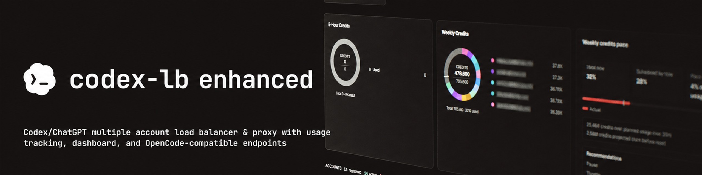

<div align="center">

# Codex LB Enhanced

### A high-availability account-pool gateway built for long-running Codex sessions

**English | [简体中文](README.zh-CN.md)**

<p><strong>Account-pool switching is still being improved.</strong> I originally thought this issue was solved, but extensive testing shows that it can still occasionally fail to recover. Don't worry—I’m working on it; if you have a good idea, please open a PR.</p>

<p>
  <a href="https://github.com/aafqaq/codex-lb-enhanced/actions/workflows/build-custom-image.yml"></a>
  <a href="https://github.com/aafqaq/codex-lb-enhanced/releases"></a>
  <a href="https://github.com/aafqaq/codex-lb-enhanced/pkgs/container/codex-lb-enhanced"></a>
  <a href="https://github.com/aafqaq/codex-lb-enhanced/blob/main/LICENSE"></a>
</p>

<p>
  <a href="https://github.com/aafqaq/codex-lb-enhanced/tree/main/docs">Documentation</a> ·
  <a href="https://github.com/aafqaq/codex-lb-enhanced/issues">Issues</a> ·
  <a href="https://github.com/aafqaq/codex-lb-enhanced/discussions">Discussions</a>
</p>



<p><strong>Not just another reverse proxy: a session-aware gateway designed for “stop anywhere, continue anytime” Codex workflows.</strong></p>

</div>

> **Independent enhanced distribution.** This project is independently maintained on top of [Soju06/codex-lb](https://github.com/Soju06/codex-lb). It is not an official OpenAI, ChatGPT, or upstream Codex release. It retains the original account pool and API compatibility while adding a production-focused continuity, failover, quota, and observability layer.

## Why Enhanced?

Codex sessions are stateful, long-lived, and frequently interrupted by conditions a conventional load balancer does not understand: an upstream account reaches its quota, an operator pauses an account, a WebSocket disappears without a close frame, a tool call is interrupted, or a user resumes the same conversation hours later.

Codex LB Enhanced treats those failures as gateway responsibilities. Whenever recovery is safe, the client should experience a slower response—not a lost conversation or an unexplained `stream disconnected before completion`.

<table>
<tr>
<td width="33%"><h3>🔁 Transparent failover</h3>Quota exhaustion, suspension, timeout, and incomplete streams are classified separately. Failed accounts leave the current candidate set before the original load-balancing policy selects the next one.</td>
<td width="33%"><h3>🧠 Session continuity</h3>Verified request history is preserved and replayed across accounts when safe, including resumed turns and interrupted tool-call context.</td>
<td width="33%"><h3>📡 Transport resilience</h3>Codex Responses, the HTTP session bridge, and upstream WebSockets cooperate. Pre-first-event failures can fall back without exposing a broken stream.</td>
</tr>
<tr>
<td><h3>📊 Native Codex quota semantics</h3>Expose API-key limits or pooled-account estimates through Codex-style primary, secondary, and credits headers, backed by the same data as <code>/v1/usage</code>.</td>
<td><h3>🎛️ Per-key policy</h3>Configure time windows, models, quota types, display source, and passthrough independently for every API key.</td>
<td><h3>🔎 Actionable diagnostics</h3>Correlate requests with upstream accounts, transport, failover stage, quota reason, retry count, and final client-facing semantics. No anonymous telemetry.</td>
</tr>
</table>

## What it adds over the base distribution

The upstream project provides the foundation: multiple ChatGPT accounts, load balancing, usage tracking, API-key management, an OpenAI-compatible API, and a web dashboard. Enhanced keeps those capabilities and concentrates the complicated recovery paths into a more explicit, testable, and extensible flow.

| Capability | Base behavior | Codex LB Enhanced |
|---|---|---|
| Account selection | Multi-account load balancing | Preserves the configured selector and rotation policy; adds request-scoped failed-account exclusion |
| Quota exhaustion | May surface one account's limit directly | Records the real quota response, excludes that account for the attempt, and walks the usable pool before returning a final limit |
| `previous_response_id` ownership | Often tied to the original upstream account | Prefers the original owner, then performs safe recovery from verified full history when that owner is unavailable |
| WebSocket disconnects | A lost connection may become `stream_incomplete` | Distinguishes pre-output, partial-output, and completed streams; coordinates retries, HTTP bridge fallback, and replay |
| Interrupted tools and manual stops | Can remain dependent on the previous account | Preserves tool-call state and only crosses accounts at recovery-safe boundaries |
| Codex quota display | Primarily reflects pooled upstream data | Uses custom API-key limits when configured, otherwise pooled estimates; `/v1/usage` shares the same source of truth |
| Observability | Basic request logs | Records upstream events, ownership, account selection, recovery decisions, retries, and terminal semantics |
| Client compatibility | Depends heavily on client retries | Prioritizes official Codex semantics while retaining the `/v1` contract for other OpenAI-compatible clients |

### Recovery flow

```text
Client request
    │
    ├─ account succeeds ─────────────────► normal streaming response
    │
    └─ quota / suspension / timeout / disconnect
          │
          ├─ record the actual upstream cause and settle the attempt
          ├─ exclude the failed account from this request
          ├─ select the next account through the configured LB policy
          ├─ replay verified full context (HTTP bridge when required)
          └─ return a client-visible terminal error only when the pool is exhausted
```

## Interfaces and clients

- **Codex desktop, CLI, and IDE integrations:** `/backend-api/codex`, Responses wire protocol, WebSocket support, and Codex quota headers. The latest Codex clients may also call the root `/responses` and `/responses/compact` aliases directly; both forms are supported.
- **OpenAI-compatible clients:** `/v1`, including Responses, Chat Completions, models, and usage endpoints. Root `/responses` and `/responses/compact` are equivalent compatibility aliases.
- **Web dashboard:** accounts, API keys, usage windows, reports, request logs, and recovery diagnostics.
- **Upstream transports:** HTTP and WebSocket, with deployment-level forcing and bridge-assisted fallback.

## API-key quotas and `/v1/usage`

Quota enforcement and quota presentation are two views of the same data:

1. Configure `5h`, `daily`, `7d`, `weekly`, or `monthly` windows for an API key, using credits, tokens, or cost limits.
2. Enable Codex quota emulation and choose **API-key limits** or **pooled-account estimates** as the display source.
3. Codex routes map that source to native-style primary/secondary/credits headers; `/v1/usage` exposes the corresponding details to other clients and automation.
4. Model-specific limits still enforce and account normally, but only global limits become the default Codex window so one model's cap is not misrepresented as a global cap.

## Quick start

```bash
docker network inspect codex-lb-net >/dev/null 2>&1 || docker network create codex-lb-net
docker volume create codex-lb-enhanced-data
docker run -d --name codex-lb-enhanced \
  --restart unless-stopped \
  -e CODEX_LB_HTTP_RESPONSES_SESSION_BRIDGE_AMBIGUOUS_CONTINUATION_RECOVERY_MODE=server_indefinite_recovery \
  --network codex-lb-net \
  -p 2455:2455 -p 1455:1455 \
  -v codex-lb-enhanced-data:/var/lib/codex-lb \
  ghcr.io/aafqaq/codex-lb-enhanced:1.25.3
```

Open [http://localhost:2455](http://localhost:2455), complete initialization, add accounts, and create an API key. For production, keep your existing ports, volume, environment, network, and restart policy; pin a versioned image and back up the data volume before upgrades.

### Codex client example

Add a provider to `~/.codex/config.toml`:

```toml
model = "gpt-5.6-sol"
model_reasoning_effort = "xhigh"
model_provider = "codex-lb-enhanced"

[model_providers.codex-lb-enhanced]
name = "openai"
base_url = "http://127.0.0.1:2455/backend-api/codex"
wire_api = "responses"
supports_websockets = true
requires_openai_auth = true
```

Replace `base_url` with your reverse-proxy address and use an API key created in the dashboard. Other clients can continue using `/v1` without changing their OpenAI SDK integration.

For a client that appends `/responses` directly to the server root, use `http://127.0.0.1:2455` as its base URL. The resulting `/responses` and `/responses/compact` requests are routed to the same OpenAI-compatible handlers.

### Run locally from source

The application launcher is the same one used by the package and Docker image:

```bash
uv sync --dev --frozen
uv run codex-lb
```

## Operations

- **Persistence:** SQLite data lives under `/var/lib/codex-lb/` by default; PostgreSQL remains supported.
- **Upgrades:** back up the named volume, pin release tags in production, and retain the previous image for rollback.
- **Troubleshooting:** correlate request IDs with `usage_limit_reached`, `stream_incomplete`, `upstream_request_timeout`, and `http_bridge` events.
- **Security boundary:** do not expose the admin port directly; use TLS, reverse-proxy access control, and least privilege.
- **Privacy:** this distribution sends no anonymous telemetry. Account, request, and usage data stay in the database and logs you operate.

## Release and image

Current release: **v1.25.3**. This release adapts the Responses routing used by the latest Codex clients, including GPT‑6-compatible clients that send root `/responses` requests. GitHub Actions validates every `main` change, publishes the rolling GHCR image, and publishes versioned images and Python artifacts through GitHub Releases. For production, use the immutable version tag [v1.25.3](https://github.com/aafqaq/codex-lb-enhanced/releases/tag/v1.25.3) instead of `latest`.

## License and disclaimer

MIT licensed; see [LICENSE](LICENSE). This is a community-maintained independent distribution and does not represent OpenAI, ChatGPT, or the upstream Codex project's commitments.
