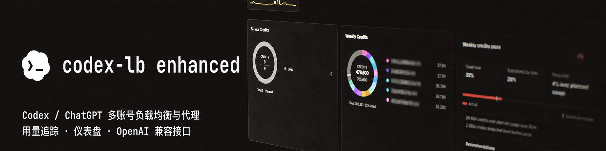

<div align="center">

# Codex LB Enhanced

### 面向 Codex 长会话的高可用账号池网关

**[English](README.md) | 简体中文**

<p><strong>号池账号切换问题仍在持续修复中。</strong>我原本以为已经解决，但经过高强度测试，偶尔仍会出现无法恢复的情况。不过不用担心，我正在尝试解决这个问题；如果你有好的想法，欢迎提交 PR。</p>

<p>
  <a href="https://github.com/aafqaq/codex-lb-enhanced/actions/workflows/build-custom-image.yml"></a>
  <a href="https://github.com/aafqaq/codex-lb-enhanced/releases"></a>
  <a href="https://github.com/aafqaq/codex-lb-enhanced/pkgs/container/codex-lb-enhanced"></a>
  <a href="https://github.com/aafqaq/codex-lb-enhanced/blob/main/LICENSE"></a>
</p>

<p>
  <a href="https://github.com/aafqaq/codex-lb-enhanced/tree/main/docs">使用文档</a> ·
  <a href="https://github.com/aafqaq/codex-lb-enhanced/issues">问题反馈</a> ·
  <a href="https://github.com/aafqaq/codex-lb-enhanced/discussions">讨论区</a>
</p>



<p><strong>不是简单的请求转发器，而是为“随时中断、随时继续”的 Codex 工作流设计的会话网关。</strong></p>

</div>

> **独立增强发行版**　基于 [Soju06/codex-lb](https://github.com/Soju06/codex-lb) 独立维护。它不是 OpenAI、ChatGPT 或上游 Codex 的官方产品；增强功能集中在会话连续性、故障恢复、额度语义和可观测性，原有账号池与 API 兼容能力仍然保留。

## 一眼看懂：为什么选择 Enhanced

Codex LB Enhanced 的目标很明确：当某个上游账号额度耗尽、被暂停、WebSocket 意外断开、网络抖动，或用户隔了几小时再继续旧对话时，客户端尽量只感到“多等了一会儿”，而不是丢失上下文或看到 `stream disconnected before completion`。

<table>
<tr>
<td width="33%"><h3>🔁 无感故障切换</h3>额度耗尽、账号暂停、超时、断流按原因分类处理；当前账号退出本轮候选后再选择下一个，避免 A→B→A 原地打转。</td>
<td width="33%"><h3>🧠 会话连续性</h3>保留可验证的完整请求历史；安全时跨账号重放，覆盖继续对话、工具调用中断和延迟恢复。</td>
<td width="33%"><h3>📡 传输容错</h3>Codex Responses、HTTP bridge 与上游 WebSocket 协同工作；首事件前可安全回退，降低单条 WS 连接对会话的影响。</td>
</tr>
<tr>
<td><h3>📊 原生额度语义</h3>可按 API Key 自定义额度或账号池估算生成 Codex 官方风格的 primary、secondary、credits 等响应头，并与 `/v1/usage` 保持一致。</td>
<td><h3>🎛️ 精细化 API Key</h3>按时间窗口、模型和用量类型设置限制；额度展示策略、是否透传和用量分区可独立控制。</td>
<td><h3>🔎 可观测与可排障</h3>记录请求、上游账号、传输方式、重试/切换阶段、额度原因和最终失败语义；不包含匿名遥测。</td>
</tr>
</table>

## 与基础版的差异

Enhanced 保留上游项目成熟的账号管理、API Key 鉴权、负载均衡、用量统计和 OpenAI 兼容接口，并把最容易影响生产体验的会话链路重新收敛为可测试、可扩展的恢复流程。

| 能力 | 基础版行为 | Codex LB Enhanced |
|---|---|---|
| 账号池与轮换 | 多账号负载均衡 | 保留原选择器与轮换规则；请求级排除故障账号，不污染全局策略 |
| 上游额度耗尽 | 可能直接把限额错误交给客户端 | 记录真实额度原因，当前账号退出本轮，自动尝试池内其他可用账号；整个候选池耗尽后才返回最终限额 |
| `previous_response_id` | 对原账号归属较敏感 | 优先使用原归属；不可用时根据完整历史进行安全恢复，避免把新账号当成空会话 |
| WebSocket 断流 | 单条连接失败容易表现为 `stream_incomplete` | 区分首事件前/已有输出/已完成事件，结合 HTTP bridge、重试和上下文重放 |
| 工具调用与中途暂停 | 中断后容易依赖原账号状态 | 保留工具调用上下文与未完成阶段；切换只发生在确认可恢复的边界 |
| Codex 额度展示 | 主要反映账号池响应 | API Key 有自定义限制时显示该限制；没有时回退账号池估算；`/v1/usage` 与响应头共享同一口径 |
| 诊断信息 | 基础请求日志 | 上下游事件、账号选择、恢复决策、重试次数和最终语义可关联排查 |
| 客户端兼容 | 依赖各客户端自己的重试能力 | 对 Codex 优先对齐官方语义，同时保持 `/v1` 与其他兼容客户端的正常合约 |

### 恢复决策（简化流程）

```text
客户端请求
    │
    ├─ 当前账号成功 ───────────────► 正常流式响应
    │
    └─ 额度/暂停/超时/断流
          │
          ├─ 记录真实上游原因 + 结算当前请求
          ├─ 当前账号加入本轮排除集合
          ├─ 按原负载均衡规则选择下一个可用账号
          ├─ 带完整上下文重放（必要时走 HTTP bridge）
          └─ 仅当候选池确实耗尽，才返回客户端可理解的最终错误
```

## 支持的接口与客户端

- **Codex 客户端 / IDE**：`/backend-api/codex`，支持 Responses 与官方额度响应头。
- **OpenAI 兼容客户端**：`/v1`，保留 Chat Completions、Responses、模型和用量接口。
- **管理仪表盘**：账号池、API Key、用量、额度窗口、请求日志和恢复诊断集中管理。
- **上游传输**：HTTP 与 WebSocket；可按部署环境选择或让 bridge 承担回退。

## API Key 额度与 `/v1/usage`

额度限制和额度展示是同一套数据的两种视图：

1. 在 API Key 中配置 `5h`、`daily`、`7d`、`weekly` 或 `monthly` 窗口，以及 `credits`、token、费用等上限。
2. 开启 Codex 额度伪装后，Codex 路径把 API Key 限制映射为官方风格的 `primary`/`secondary` 响应头；没有自定义限制时使用账号池估算。
3. `/v1/usage` 返回同一 API Key 的明细，便于非 Codex 客户端、面板和自动化脚本读取。
4. 模型专属限制仍用于拦截和统计，但只有全局限制才会作为默认 Codex 窗口展示，避免把某个模型的额度误报成全局额度。

## 快速部署

```bash
docker volume create codex-lb-enhanced-data
docker network inspect codex-lb-net >/dev/null 2>&1 || docker network create codex-lb-net
docker run -d --name codex-lb-enhanced \
  --restart unless-stopped \
  --network codex-lb-net \
  -e CODEX_LB_HTTP_RESPONSES_SESSION_BRIDGE_AMBIGUOUS_CONTINUATION_RECOVERY_MODE=server_indefinite_recovery \
  -p 2455:2455 -p 1455:1455 \
  -v codex-lb-enhanced-data:/var/lib/codex-lb \
  ghcr.io/aafqaq/codex-lb-enhanced:1.25.2
```

打开 [http://localhost:2455](http://localhost:2455)，完成初始化、添加账号并创建 API Key。生产环境请把端口、卷、环境变量和重启策略替换成你的现有配置；升级前保留旧镜像标签以便回滚。

### Codex 客户端配置示例

在 `~/.codex/config.toml` 中配置一个 provider：

```toml
model = "gpt-5.6-sol"
model_reasoning_effort = "xhigh"
model_provider = "codex-lb-enhanced"

[model_providers.codex-lb-enhanced]
name = "openai"
base_url = "http://127.0.0.1:2455/backend-api/codex"
wire_api = "responses"
supports_websockets = true
requires_openai_auth = true
```

将 `base_url` 换成反向代理地址即可；API Key 使用仪表盘创建的 Key。其他客户端继续使用 `/v1`，无需改变原有 OpenAI SDK 调用方式。

### 从源码运行

源码、Python 包和 Docker 镜像使用同一个应用启动器：

```bash
uv sync --dev --frozen
uv run codex-lb
```

## 运行、升级与排障

- **数据持久化**：默认 SQLite 位于 `/var/lib/codex-lb/`；可按原项目配置 PostgreSQL。
- **升级策略**：拉取新 GHCR 镜像前先备份数据卷；使用固定版本标签，不建议生产直接跟随 `latest`。
- **日志重点**：搜索 `usage_limit_reached`、`stream_incomplete`、`upstream_request_timeout`、`http_bridge`，再结合请求 ID 查看账号选择与恢复阶段。
- **安全边界**：不要把管理端口暴露到公网；通过反向代理、TLS、访问控制和最小权限保护管理面板。
- **隐私**：本发行版不发送匿名遥测；业务请求、账号和用量数据只写入你配置的本地/自有数据库与日志系统。

## 版本与构建

当前发布版本：**v1.25.2**。每次 `main` 变更都会经过 GitHub Actions 验证并更新 GHCR 滚动镜像；正式版本还会发布带版本号的镜像和 Python 构建产物。生产环境建议使用不可变的 [v1.25.2](https://github.com/aafqaq/codex-lb-enhanced/releases/tag/v1.25.2) 标签，不要直接使用 `latest`。镜像包位于 [GitHub Container Registry](https://github.com/aafqaq/codex-lb-enhanced/pkgs/container/codex-lb-enhanced)。

## 许可证与免责声明

本项目采用 MIT 许可证，详见 [LICENSE](LICENSE)。它是社区维护的独立增强发行版，不代表 OpenAI、ChatGPT 或上游 Codex 项目的立场与承诺。
