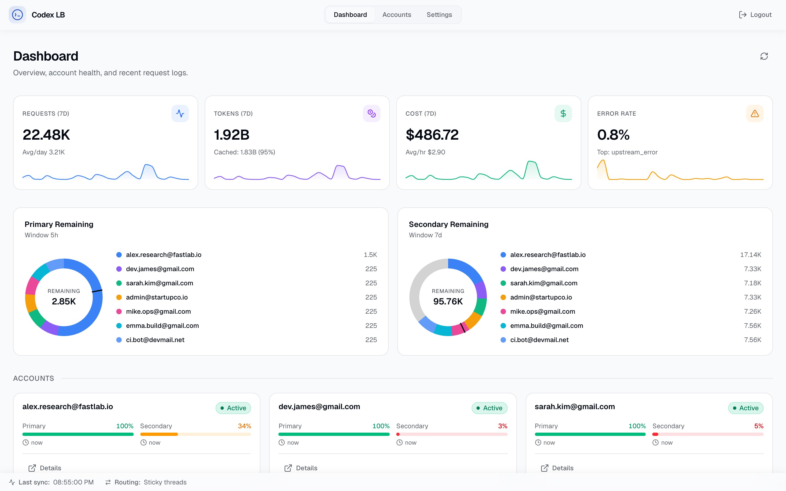

<div align="center">

# Codex LB Enhanced

### 面向长对话连续性的 Codex 兼容账号池网关

<p>
  <a href="https://github.com/aafqaq/codex-lb-enhanced/actions/workflows/build-custom-image.yml"></a>
  <a href="https://github.com/aafqaq/codex-lb-enhanced/releases"></a>
  <a href="https://github.com/aafqaq/codex-lb-enhanced/blob/main/LICENSE"></a>
  <a href="https://github.com/aafqaq/codex-lb-enhanced/pkgs/container/codex-lb-enhanced"></a>
</p>

<p><a href="./README.md">English</a> · <a href="https://aafqaq.github.io/codex-lb-enhanced/">文档</a> · <a href="https://github.com/aafqaq/codex-lb-enhanced/issues">问题反馈</a> · <a href="https://github.com/aafqaq/codex-lb-enhanced/discussions">讨论</a></p>


<p><em>账号池不丢，会话不断，异常可恢复。</em></p>

</div>

> **独立发行版。** Codex LB Enhanced 基于 [Soju06/codex-lb](https://github.com/Soju06/codex-lb) 独立维护，不是 OpenAI 或上游 Codex 的官方发布版本。上游 MIT 许可证和版权声明均予以保留。

## 项目是什么

Codex LB 是 ChatGPT 账号负载均衡器：聚合多个账号、追踪用量、管理 API Key，并在仪表盘中查看全部状态。它提供 OpenAI 兼容接口，可用于 Codex CLI、Codex IDE、OpenCode、OpenClaw、Hermes Agent 以及其他 OpenAI 客户端。

Codex LB Enhanced 保留这套通用基础能力，重点处理长时间 Codex 对话最容易遇到的问题：上游 WebSocket 中途断开、某个账号额度耗尽、桌面端关闭数小时或数天后重新尝试，以及桥接层尚未完成持久化时发生的超时竞态。

## 为什么选择 Enhanced

| 能力 | 原版 Codex LB | Codex LB Enhanced |
|---|---|---|
| 账号池 | 多 ChatGPT 账号负载均衡 | 保持原选择器和调度语义，增加请求级故障账号排除 |
| Codex 额度 | 主要展示账号池上游估算 | 优先展示 API Key 自定义额度；没有自定义额度时回退到账号池估算 |
| 额度耗尽 | 一个账号耗尽可能直接终止会话 | 自动遍历仍可用账号，全部耗尽后才返回池级 429 |
| WebSocket 中断 | 依赖当前桥接缓存和连接状态 | 首个事件前可安全回退 HTTP，延迟重试可从持久化记录恢复归属 |
| 中途额度错误 | 按普通终止错误处理 | 不重复已显示文本或工具调用，交由 Codex 客户端走原生重试边界 |
| HTTP Bridge | 嵌套恢复和事件/空闲竞态较敏感 | 增加恢复围栏、迭代器清理和收到事件先于持久化的活动标记 |
| 上下文压缩 | 异常 2xx 可能被当成成功 | 缺少压缩输出时进入重试/切换流程，不交付伪成功结果 |
| 发布运维 | 使用上游镜像和更新地址 | 独立 GHCR 镜像、自动构建、独立更新检测 |

增强逻辑叠加在原负载均衡器之上，不替换 API Key 鉴权、账号分配、预留额度、路由策略或普通 `/v1` 合约。

## 核心能力

<table>
<tr><td><b>账号池</b><br>多个 ChatGPT 账号负载均衡</td><td><b>用量追踪</b><br>账号 token、费用和历史趋势</td><td><b>API Key</b><br>按 token、费用、窗口和模型限额</td></tr>
<tr><td><b>仪表盘鉴权</b><br>密码及可选 TOTP</td><td><b>兼容接口</b><br>Codex CLI、OpenCode 等客户端</td><td><b>模型同步</b><br>从上游获取可用模型</td></tr>
<tr><td><b>原生额度头</b><br>primary、secondary、monthly 和 credits</td><td><b>连续会话</b><br>断网、切号和延迟重试恢复</td><td><b>传输容错</b><br>自动模式下安全回退 HTTP</td></tr>
</table>

| 仪表盘 | 账号池 |
|:---:|:---:|
|  |  |

## 快速部署

```bash
docker volume create codex-lb-enhanced-data
docker run -d --name codex-lb-enhanced \
  --restart unless-stopped \
  -e CODEX_LB_HTTP_RESPONSES_SESSION_BRIDGE_AMBIGUOUS_CONTINUATION_RECOVERY_MODE=server_indefinite_recovery \
  -p 2455:2455 -p 1455:1455 \
  -v codex-lb-enhanced-data:/var/lib/codex-lb \
  ghcr.io/aafqaq/codex-lb-enhanced:latest
```

打开 [localhost:2455](http://localhost:2455)，添加账号、创建 API Key，再将客户端配置到 Responses 接口。

## Codex 客户端配置

Codex CLI 或 IDE 集成可在 `~/.codex/config.toml` 中配置：

```toml
model = "gpt-5.6-sol"
model_reasoning_effort = "xhigh"
model_provider = "codex-lb-enhanced"

[model_providers.codex-lb-enhanced]
name = "openai"
base_url = "http://127.0.0.1:2455/backend-api/codex"
wire_api = "responses"
supports_websockets = true
requires_openai_auth = true
```

| 客户端 | 接口 | 说明 |
|---|---|---|
| **Codex CLI / IDE** | `/backend-api/codex` | 原生 Responses 与 compact |
| **OpenCode** | `/v1` | OpenAI 兼容接口 |
| **OpenClaw** | `/v1` | OpenAI 兼容接口 |
| **Hermes Agent** | `/v1` | OpenAI 兼容接口 |
| **OpenAI SDK** | `/v1` | 标准 API 客户端配置 |

## 恢复逻辑

```text
Codex 请求
   │
   ├─ 原账号选择器（不变）
   │
   ├─ 上游额度耗尽 ─► 排除当前账号 ─► 选择下一个可用账号
   │                         │
   │                         └─ 没有账号 ─► 返回原生 429 和重置信息
   │
   ├─ WebSocket 首事件前失败 ─► 尝试等价 HTTP 流
   │
   └─ 已有可见输出 ─► 不重复播放；交给 Codex 客户端整轮重试
```

传输失败和账号额度耗尽是两种不同证据：网络断开不会自动污染账号，确认的上游额度错误才会触发账号切换。“无限恢复”表示恢复资格可持久化，不表示无限制占用资源；请求截止时间、恢复围栏和账号池边界仍然有效。

## 配置、数据与升级

配置使用 `CODEX_LB_` 前缀或 `.env.local`，可从 [`.env.example`](.env.example) 开始。SQLite 是默认数据库，也支持通过 `CODEX_LB_DATABASE_URL` 使用 PostgreSQL。

| 环境 | 数据目录 |
|---|---|
| 本地 / `uvx` | `~/.codex-lb/` |
| Docker | `/var/lib/codex-lb/` |

请始终挂载命名卷，升级前备份数据并保留旧镜像标签，以便快速回滚。镜像地址为 `ghcr.io/aafqaq/codex-lb-enhanced`。

## 文档与开发

文档覆盖入门、客户端配置、鉴权、API Key、路由、数据库、Docker/Kubernetes 部署和故障排查：[文档站](https://aafqaq.github.io/codex-lb-enhanced/)。

```bash
uv sync
uv run pytest

cd frontend
bun install
bun run dev
```

`custom/resilient-streams-v1.24` 分支会通过 [GitHub Actions](.github/workflows/build-custom-image.yml) 自动构建并发布到 GHCR。

## 项目边界与致谢

本项目继承上游的账号池、仪表盘、用量统计、API Key 管理、客户端兼容性和部署模型；增强代码在本仓库独立维护，不会自动合并回上游。

需要原版通用负载均衡器时，请使用 [Soju06/codex-lb](https://github.com/Soju06/codex-lb)。如果你更重视 Codex 桌面端的连续会话、API Key 原生额度展示和异常后的无感恢复，请使用本版本。

## 许可证

MIT，详见 [LICENSE](LICENSE)。
